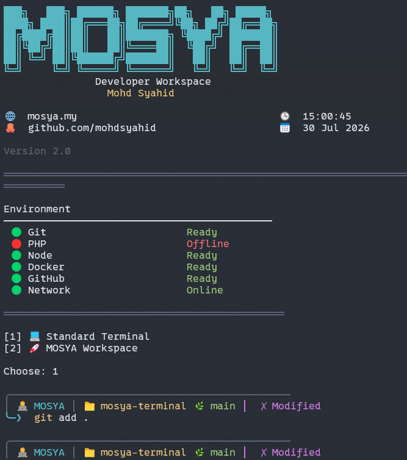

<div align="center">

# 🚀 MOSYA Terminal

### Lightweight PowerShell Developer Workspace for Windows


A modular PowerShell environment designed for developers who want a clean startup dashboard, workspace launcher, and a fast custom terminal experience.


</div>

---

## ✨ Features

- 🚀 Fast PowerShell startup
- 🖥 Beautiful startup dashboard
- 📂 Workspace launcher
- 🌿 Git branch prompt
- 📦 Modular architecture
- ⚡ Lightweight and fast
- 🎨 Easy customization
- 💻 Designed for Windows developers

---


## 📸 Screenshot

<p align="center">
    
</p>

---

# 📦 Installation

Clone repository

```powershell
git clone https://github.com/mohdsyahid/mosya-terminal.git
```

Go into project

```powershell
cd mosya-terminal
```

Run installer

```powershell
.\install.ps1
```

Restart PowerShell.

Done. 🎉

---

# 📁 Project Structure

```
mosya-terminal
│
├── .github
├── .mosya
│   ├── assets
│   ├── backup
│   ├── components
│   ├── modules
│   ├── themes
│   │
│   ├── banner.ps1
│   ├── config.ps1
│   ├── functions.ps1
│   ├── profile.ps1
│   ├── projects.ps1
│   ├── startup.ps1
│   ├── theme.ps1
│   └── workspace.ps1
│
├── install.ps1
├── uninstall.ps1
├── CHANGELOG.md
├── LICENSE
└── README.md
```

---

# 🏗 Architecture

```
PowerShell
     │
     ▼
PROFILE
     │
     ▼
.mosya/profile.ps1
     │
     ├── config.ps1
     ├── projects.ps1
     ├── functions.ps1
     ├── theme.ps1
     └── startup.ps1
             │
             ▼
      Dashboard + Workspace
```

---

# ⚙ Requirements

- Windows 10 / Windows 11
- PowerShell 7+
- Git

Optional

- Docker
- Node.js
- PHP
- GitHub CLI

MOSYA Terminal automatically detects available tools.

---

# 🎯 Roadmap

## ✅ Version 1.0

- [x] Startup Dashboard
- [x] Workspace Launcher
- [x] Custom Prompt
- [x] Modular Architecture
- [x] PowerShell Installer

---

## 🚀 Future

- [ ] Plugin System
- [ ] Theme Marketplace
- [ ] Auto Update
- [ ] Package Manager
- [ ] Workspace Profiles
- [ ] Terminal Themes
- [ ] Cross-platform Support

---

# 🤝 Contributing

Contributions, feature requests and bug reports are welcome.

Feel free to fork the repository and submit a Pull Request.

---

# 👨‍💻 Author

**Mohd Syahid**

🌐 Website

https://mosya.my

GitHub

https://github.com/mohdsyahid

---

# 📄 License

This project is licensed under the MIT License.

---

<div align="center">

### ⭐ If you like this project, consider giving it a Star.

Made with ❤️ using PowerShell.

</div>
